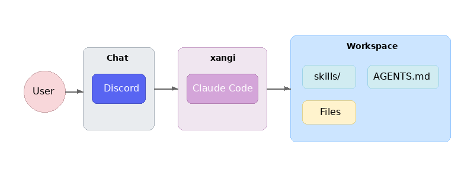

# 設計ドキュメント

thorのアーキテクチャと設計思想について説明します。

## 概要

thorは「Claude Codeをチャットプラットフォームから使えるようにするラッパー」です。

```
User → Discord → thor → AI CLI → Workspace
```

## アーキテクチャ



### レイヤー構成

| レイヤー | 役割 | 実装 |
|----------|------|------|
| Chat | ユーザーインターフェース | Discord.js |
| thor | AI CLIの統合・制御 | index.ts, agent-runner.ts |
| AI CLI | 実際のAI処理 | Claude Code |
| Workspace | ファイル・スキル | skills/, AGENTS.md |

## コンポーネント

### エントリーポイント（index.ts）

メインのオーケストレーター。以下を統合：

- Discordクライアントの初期化
- メッセージ受信とルーティング
- AI CLIの呼び出し
- スケジューラーの管理
- コマンド処理（`!discord`, `!schedule` 等）

### エージェントランナー（agent-runner.ts）

AI CLIを抽象化するインターフェース：

```typescript
interface AgentRunner {
  run(prompt: string, options?: RunOptions): Promise<RunResult>;
  runStream(prompt: string, callbacks: StreamCallbacks, options?: RunOptions): Promise<RunResult>;
}
```

### システムプロンプト（base-runner.ts）

thorがAI CLIに注入するシステムプロンプトを管理：

- **チャットプラットフォーム情報** — Discord経由の会話であることを伝える短い固定テキスト
- **THOR_COMMANDS.md** — `prompts/THOR_COMMANDS.md` からDiscord操作コマンド・スケジューラー等の仕様を読み込み

AGENTS.md / CHARACTER.md / USER.md 等のワークスペース設定は、各AI CLIの自動読み込み機能に委譲：

| CLI | 自動読み込みファイル | 注入方法 |
|-----|---------------------|----------|
| Claude Code | `CLAUDE.md` | `--append-system-prompt`（一回限り） |

### AI CLIアダプター

| ファイル | 対応CLI | 特徴 |
|----------|---------|------|
| claude-code.ts | Claude Code | ストリーミング対応、セッション管理 |
| persistent-runner.ts | Claude Code（常駐） | `--input-format=stream-json` で常駐プロセス化、キュー管理、サーキットブレーカー |

### スケジューラー（scheduler.ts）

定期実行とリマインダーを管理：

```
┌─────────────────────────────────────────────────────┐
│ Scheduler                                           │
├─────────────────────────────────────────────────────┤
│ - schedules: Schedule[]     # スケジュールデータ     │
│ - cronJobs: Map<id, CronJob> # 実行中のcronジョブ   │
│ - senders: Map<platform, fn> # メッセージ送信関数   │
│ - agentRunners: Map<platform, fn> # AI実行関数     │
├─────────────────────────────────────────────────────┤
│ + add(schedule): Schedule                          │
│ + remove(id): boolean                              │
│ + toggle(id): Schedule                             │
│ + list(): Schedule[]                               │
│ + startAll(): void                                 │
│ + stopAll(): void                                  │
└─────────────────────────────────────────────────────┘
```

**スケジュールの種類:**
- `cron`: cron式による定期実行
- `once`: 単発リマインダー（指定時刻に1回実行）

**永続化:**
- JSONファイル（`${THOR_DATA_DIR}/schedules.json`）
- ファイル変更を監視して自動リロード（debounce付き）

**タイムゾーン:**
- サーバーのシステムタイムゾーン（`TZ` 環境変数）に従う
- Docker環境では `TZ=Asia/Tokyo` 等を設定推奨

### スキルシステム（skills.ts）

ワークスペースの `skills/` ディレクトリからスキルを読み込み、スラッシュコマンドとして登録。

```
skills/
├── my-skill/
│   ├── SKILL.md      # スキル定義
│   └── scripts/      # 実行スクリプト
└── another-skill/
    └── SKILL.md
```

## データフロー

### メッセージ処理フロー

```
1. ユーザーがメッセージ送信
   ↓
2. Discordクライアントが受信
   ↓
3. 権限チェック（allowedUsers）
   ↓
4. 特殊コマンド判定
   - !discord → handleDiscordCommand()
   - !schedule → handleScheduleMessage()
   - /command → スラッシュコマンド処理
   ↓
5. AI CLIに転送（processPrompt）
   ↓
6. レスポンス処理
   - ストリーミング表示
   - ファイル添付抽出
   - SYSTEM_COMMAND検出
   - !discord / !schedule 検出・実行
   ↓
7. ユーザーに返信
```

### スケジュール実行フロー

```
1. cron/タイマーがトリガー
   ↓
2. Scheduler.executeSchedule()
   ↓
3. agentRunner(prompt, channelId)
   - AI CLIでプロンプト実行
   ↓
4. sender(channelId, result)
   - 結果をチャンネルに送信
   ↓
5. 単発の場合は自動削除
```

## 設計思想

### シングルユーザー設計

thorは**1人のユーザー**が使う前提で設計されています：

- 認証は `DISCORD_ALLOWED_USER` による単純なID照合
- セッションはチャンネル単位で管理
- マルチテナント機能は意図的に省略

### コマンドの自律実行

AIが出力する特殊コマンドを検出して自動実行：

| コマンド | 動作 |
|----------|------|
| `SYSTEM_COMMAND:restart` | プロセス再起動 |
| `!discord send ...` | Discordメッセージ送信 |
| `!schedule ...` | スケジュール操作 |

これにより、AIが自律的にシステムを操作可能。

### 永続化戦略

| データ | 保存先 | 形式 |
|--------|--------|------|
| スケジュール | `${THOR_DATA_DIR}/schedules.json` | JSON |
| ランタイム設定 | `${WORKSPACE}/settings.json` | JSON |
| セッション | `${THOR_DATA_DIR}/sessions.json` | JSON（チャンネルID→セッションID） |

## ファイル構成

```
src/
├── index.ts            # エントリーポイント、Discord統合
├── agent-runner.ts     # AI CLIインターフェース
├── base-runner.ts      # システムプロンプト生成、THOR_COMMANDS.md読み込み
├── claude-code.ts      # Claude Codeアダプター（per-request）
├── persistent-runner.ts # Claude Codeアダプター（常駐プロセス）
├── scheduler.ts        # スケジューラー
├── schedule-cli.ts     # スケジューラーCLI
├── skills.ts           # スキルローダー
├── config.ts           # 設定読み込み
├── settings.ts         # ランタイム設定
├── sessions.ts         # セッション管理
├── file-utils.ts       # ファイル操作ユーティリティ
├── process-manager.ts  # プロセス管理
└── runner-manager.ts   # 複数チャンネル同時処理（RunnerManager）

prompts/
└── THOR_COMMANDS.md   # thor専用コマンド仕様（AI CLIに注入）
```

## Docker対応

### コンテナ構成

```
┌─────────────────────────────────────────┐
│ thor container                         │
├─────────────────────────────────────────┤
│ - Node.js 22                            │
│ - Claude Code CLI                       │
│ - GitHub CLI (gh)                       │
│ - (thor-max) uv + Python 3.12          │
└─────────────────────────────────────────┘
         │
         ├── /workspace (bind mount)
         ├── /home/node/.claude (volume)
         └── /home/node/.config/gh (volume)
```

### セキュリティ

- 非rootユーザー（node）で実行
- ワークスペースのみマウント
- 認証情報はvolumeで永続化

## 環境変数一覧

### Discord

| 変数 | 説明 | 必須 |
|------|------|------|
| `DISCORD_TOKEN` | Discord Bot Token | ✅ |
| `DISCORD_ALLOWED_USER` | 許可ユーザーID（1人のみ） | ✅ |
| `AUTO_REPLY_CHANNELS` | メンションなしで応答するチャンネルID（カンマ区切り） | - |
| `DISCORD_STREAMING` | ストリーミング出力（デフォルト: `true`） | - |
| `DISCORD_SHOW_THINKING` | 思考過程を表示（デフォルト: `true`） | - |

### AIエージェント

| 変数 | 説明 | デフォルト |
|------|------|-----------|
| `AGENT_BACKEND` | AI CLI（`claude-code`） | `claude-code` |
| `AGENT_MODEL` | 使用するモデル | - |
| `WORKSPACE_PATH` | 作業ディレクトリ（ホストのパス） | - |
| `SKIP_PERMISSIONS` | デフォルトで許可スキップ | `false` |
| `TIMEOUT_MS` | タイムアウト（ミリ秒） | `300000` |
| `PERSISTENT_MODE` | 常駐プロセスモード（高速応答） | `true` |
| `MAX_PROCESSES` | 同時実行プロセス数の上限 | `10` |
| `IDLE_TIMEOUT_MS` | アイドルプロセスの自動終了時間（ミリ秒） | `1800000`（30分） |
| `THOR_DATA_DIR` | データ保存ディレクトリ | `/workspace/.thor` |

### GitHub CLI

| 変数 | 説明 |
|------|------|
| `GH_TOKEN` | GitHub CLIトークン（`gh auth token`で取得） |

## マウント設定（Docker）

| ホスト | コンテナ | 説明 |
|--------|----------|------|
| `${WORKSPACE_PATH}` | `/workspace` | 作業ディレクトリ |
| `~/.gitconfig` | `/home/node/.gitconfig` | Git設定 |
| `thor_claude-data` volume | `/home/node/.claude` | Claude認証 |

## 拡張ポイント

### 新しいチャットプラットフォーム追加

1. クライアント初期化コードを追加
2. メッセージハンドラを実装
3. `scheduler.registerSender()` で送信関数を登録
4. `scheduler.registerAgentRunner()` でAI実行関数を登録

